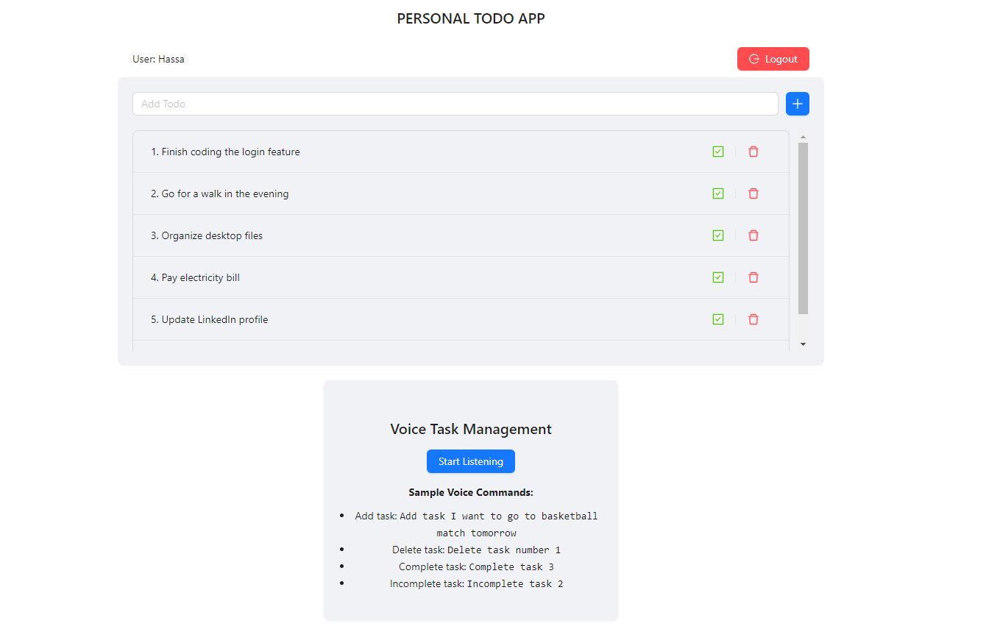

# Personal To-Do App with Voice Command Feature

A MERN stack To-Do List application with voice command functionality, enabling users to manage their daily tasks using both manual inputs and voice commands. The app uses Ant Design for UI components, integrates JWT-based authentication, and provides task management features such as adding, completing, and deleting tasks.


## Features

- Task Management: Add, complete, or delete tasks.
- Voice Commands: Control tasks with voice commands using the Web Speech API.
- User Authentication: JWT-based authentication for login, signup, and user session management.
- Responsive UI: Built using Ant Design and React, providing a modern, responsive interface.


## Tech Stack

**Client:** 
- React: For building the user interface.
- Ant Design: For UI components and layout.
- Axios: For making HTTP requests to the backend.
- Web Speech API: For voice command functionality.

**Server:** 
- Node.js: Runtime environment for server-side logic.
- Express.js: Web framework for building REST APIs.
- MongoDB: NoSQL database to store tasks and user information.
- JWT: For secure user authentication.


## Demo

Insert gif or link to demo


## Installation and Setup

Prerequisites
Ensure you have the following installed:
- Node.js 
- MongoDB
- Git

Clone the Repository

```bash
  git clone https://github.com/Hassaaniqbal/ToDoTrackr.git
  cd ToDoTrackr
```

**Setup the Backend (Server)**

Navigate to the server directory:
```bash
  cd server
```

Install dependencies:
```bash
  npm install
```

Configure the environment variables:
```bash
  PORT=5000
  MONGODB_URI=<Your MongoDB Connection String>
  JWT_SECRET=your_jwt_secret_key
  JWT_EXPIRES_IN=30d 
```
Start the backend server:
```bash
  npm run dev
```

The backend server will run at http://localhost:5000.


**Setup the Frontend (client)**

Navigate to the client directory:
```bash
  cd ../client
```

Install dependencies:
```bash
  npm install
```

Start the frontend development server:
```bash
  npm start
```

The frontend app will run at http://localhost:3000.

You can now visit http://localhost:3000 to interact with the app.


## Screenshots




## API Endpoints

**User Routes**
- POST /api/auth/signup: Register a new user.
- POST /api/auth/login: Authenticate a user and return a JWT token.
- GET /api/users/me: Get user profile information.

**Task Routes**
- GET /api/tasks: Retrieve all tasks for the authenticated user.
- POST /api/tasks/add: Add a new task.
- PATCH /api/tasks/:taskId: Mark a task as complete or incomplete.
- DELETE /api/tasks/:taskId: Delete a task
## Voice Commands

Once logged in, you can manage tasks using voice commands:

- Add a task: Say "Add task [task description]".
- Delete a task: Say "Delete task number [task number]".
- Complete a task: Say "Complete task [task number]".
- Mark task incomplete: Say "Incomplete task [task number]".
## Contributing

Contributions are always welcome!

See [contributing.md](./contributing.md) for ways to get started.

Please adhere to this project's [code of conduct](./CODE_OF_CONDUCT.md).


## License


This project is licensed under the MIT License. See the [LICENSE](./LICENSE) file for details.
